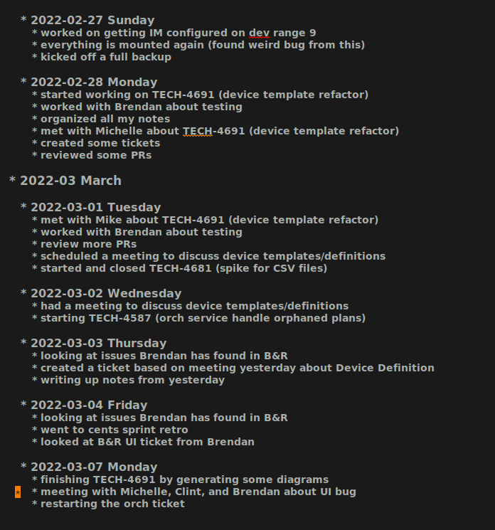

# Table of Contents

1.  [The Beautiful Nightmare that is Org Mode](#org7ab4657)
    1.  [Why learning Org Mode is so hard](#orgde59830)
    2.  [How to use this guide](#org185bbaa)
2.  [Workflows](#org4177ae0)
    1.  [How this guide is trying to solve these problems](#org13e9c3d)
    2.  [Understanding workflows](#org8239cd8)
        1.  [Understanding your workflow options](#org43696b1)
        2.  [Figuring out your first workflow](#org1fa1042)
3.  [Configuring Capture Templates](#org618a472)
    1.  [Before you start](#org5d95946)
    2.  [Default settings](#org56459aa)
    3.  [Packages to install](#org861996e)
    4.  [Configuration #1 - Work Log](#org8843302)
        1.  [Capture Template](#orgbe54655)
    5.  [Configuration #2 - Simple Note](#org03c5ef2)
        1.  [Capture Template](#org014171f)
    6.  [Configuration #3 - General TODO](#org9479403)
        1.  [Components of the TODO Item](#orge1a6377)
        2.  [Explanation of the TODO Workflow](#org0b8241b)
        3.  [Capture Template](#org824ff21)
        4.  [Org States](#orgaea4485)
    7.  [Configuration #4 - Programmer TODO](#org2f7113d)
        1.  [Tracking Bugs](#org7bf8e3a)
        2.  [Capture Template](#org33e5d31)
    8.  [Configuration #5 - Meetings](#orgebb9799)
        1.  [Capture Template](#orgafe8f00)
        2.  [Clocking Time](#orgd185013)
4.  [Tags](#org5f6665f)
    1.  [Create groups of tags](#org7da9ffe)
    2.  [Start small](#org378638e)
    3.  [Multiple tags are better than a super descriptive tag](#org95c143d)
    4.  [Defining tags](#org8721c57)
    5.  [Colorizing tags](#org8e5b1da)
5.  [Basic Agenda Usage](#org4171984)
    1.  [Agenda Weekly View](#org8a91ab5)
    2.  [Agenda TODO View](#orge66a928)
6.  [Enhanced Agenda #1](#org6fee841)
    1.  [Agenda Enhanced View](#orgf8637b6)
    2.  [Agenda Custom Command](#org8ba1a7f)
7.  [Enhanced Agenda #2](#org827e129)
    1.  [Agenda Custom Command](#orgfebec2a)
8.  [Final Thoughts](#org40c809d)

# The Beautiful Nightmare that is Org Mode

This document is a walkthrough for new Org Mode users that will show how to create an initial configuration that is both productive and easy to understand. This is the guide I wish I had found when I first started learning Org Mode. I needed an explanation that tied together a user's workflow, the Org Mode features that support that workflow, a screenshot of what that looks like, and the code to make it all happen. Hopefully this guide will help you in your journey of mastering Org Mode.

## Why learning Org Mode is so hard

Learning Org Mode is so challenging because its complexity easily becomes overwhelming. In learning about Org Mode I've found that it is often presented to new users as an impenetrable whole with no obvious starting point. The intro guides frequently describe basic functionality and then reference custom configurations by advanced users that are breathtaking in their scope and complexity. No path is given to go from novice to expert other than vague advice and useless platitudes. Most often you will hear variations on "just play with it until it makes sense".

That sentiment is, to put it bluntly, bullshit.

Other tools might have a setup wizard, sample configurations, or other tutorials to ease you into the software. However Org Mode is designed to be an open ended framework within which you the user can construct your ideal workflow. In this regards it is simpler to think of Org Mode as a programming language within Emacs. It is no wonder than adoption of this tool is so difficult. If you aren't already a programmer (one with lisp experience no less) you will find Org Mode has a brutal learning curve.

## How to use this guide

If you are new to Org Mode, I would highly recommend reading the Workflows section first. Once you feel like you understand what your own needs are, then read through the various configurations. At that point, I would highly recommend putting some of that code into your own configuration file and experimenting with Org Mode. Look at how it functions and start to get a feel for what might work for you. Once you have a more solid grasp on the basics, then come back and read up on Tags and Agendas.

There is a lot here and this is only a small fraction of what Org Mode is capable of. Take small steps and don't get discouraged. Good luck.

# Workflows

The part that everyone skips over. Org Mode was so difficult for me to learn because I started this process backwards. I started trying to use it before having any idea of what I actually wanted it to do. 

## How this guide is trying to solve these problems

Understanding org mode is a two fold process. The first step is developing a tentative workflow that works for you. The second step is figuring out what parts of org mode will support that workflow.

This guide tries to help you discover a workflow that best suits you. Then a few common org configurations will be given to show how they can support different parts of a work flow. Finally everything will be modular so that a new user can pick and choose what they want to incorporate into their system. This is not meant to be a comprehensive list of every possible workflow or feature, but rather some common examples for new users to build on.

So, let's dig into the problem.

## Understanding workflows

Most websites with Org primers offer a very detailed org configuration that supports their very specific workflow. And this is great for them, but not for your average user who might only care about 10% of that particular setup. But since it is presented as one unified whole, it can be difficult to separate out which pieces you want vs which pieces will break things for you. So before we can start writing any configuration code we need to step back and ask ourselves, what should our workflow look like?

I'm going to use this term "workflow" a lot in this document and to prevent any confusion, let's clearly define it now. A workflow is the sum of all the steps you take when processing information with Org Mode. Everything you do that ultimately is meant to interact with Org Mode is part of your workflow.

For example, here are two workflows, one for my personal life and one for my job:

**Personal Workflow**
"I want to keep a journal of my thoughts, track home projects, and plan out my personal programming endeavors."

**Professional Workflow**
"I want to track my accomplishments at work, organize the tickets I have been assigned, record data produced in meetings, summarize everything, and display metrics of my productivity."

When thinking of your own workflow, start off by filling in the sentence "I want to use org mode to \_"

Before you can write any configuration code or really get any use out of Org Mode you need to clearly define your goals.

### Understanding your workflow options

So here we are. You want to use Org Mode to do&#x2026;something. You aren't totally sure what but a lot of really smart people seem to think it is useful so you want to give it a try. And so you did what most new users do. You read the startup guide, you skim the docs, you realize you don't understand anything, and shortly thereafter you gave up in despair.

But not today. Today is going to be different.

So let's start off the right way by first brainstorming some ideas on how you want this whole thing to work. Initially you should focus only on establishing the simplest version of your own workflow. Go into this assuming that this is going to change and that nothing here is set in stone. Instead, treat this as a first draft that will get thrown away, redesigned, or heavily modified as you further understand what it is you really hope to get out of Org Mode. Look through the following list and see if any of these things are something you would want to integrate into your new Org Mode workflow.

**Common Workflow Components**

-   handling emails
-   recording meeting notes
-   tracking time sensitive events
-   tracking reoccurring events
-   general to-do items
-   journals
-   work logs
-   prioritizing tasks
-   tracking your time
-   generating reports
-   outlining presentations
-   outlining a book
-   tracking JIRA tickets
-   tracking bugs in code
-   exporting documents to common formats

And so on and so on.

As a side note, something that took me a while to wrap my head around was that not everything has to be interconnected. So if you want to keep a journal, there is no reason that it has to be integrated into anything else. Where as you might want to keep your meetings in one file, your TODOs in another, and reference both of them in your agenda view.

### Figuring out your first workflow

So at this point you should take a look at the list above (which is by no means meant to be taken as comprehensive) and decide what pieces you want to implement. I'm not going to implement every one of these examples (that would be a small book and I'm not *that* committed to this enterprise) but I am going to implement several of the more important ones and hopefully that will serve as a foundation on which to build your own workflow.

Once you figure out what you want to do, starting thinking of the simplest way that you would like to reorganize your workflow to incorporate org mode. For example, don't do this:

*"what are all the steps required to interface with my email client, import my emails, tag them, create TODO's from them, and then sort them in my Agenda View&#x2026;"*

and instead do this:

*"I want to make TODOs based on my email"*

Note that the second one doesn't require any fancy configuration. Of course, this means that there are going to be a lot of manual steps, BUT THAT IS OK! So in this example, imagine that you come up with the following work flow:

**New possible workflow**

-   open gmail in my web browser
-   look at my unread messages
-   open up emacs
-   create a new Email TODO
-   fill in all the details by copy and pasting into emacs
-   do this for a week
-   live my best life

Now I get what you are thinking. This is a lot of work. This is boring. This isn't leveraging anything! Where is the magic I was promised?

I feel you, I really do. But we aren't there yet. This step is all about seeing if this prototype workflow is actually going to be useful. If it is then great! You can go down the road of turning emacs into your own email sorting hub. But you might do this for a few days and realize that you really don't get that many TODOs from your email, but instead you get them from meetings and then people just email you later to confirm details. So maybe making your emails the center point of this workflow isn't what you really need.

Unfortunately there is no shortcut here. You just have to try a bunch of things out and see what clicks for you. Everyone has different needs and this is most definitely not a one-size-fits-all type of solution. But the key here is to try different approaches, do it all manually so you have minimal investment (think of how frustrating it would have been to spend 10 hours configuring your mail settings only to never use it), and then refine the parts that work for you.

# Configuring Capture Templates

In this section you will find five different configurations that support some of the workflow elements mentioned previously. These are all similar enough to show the common design behind how Org Mode operates, while hopefully being different enough to show off some of Org's most useful features.

Now we get to the heart of things. Listed below are a series of steps that should, at the very least, be read in order. Not every configuration depends on the ones before it, but many do. So while I've tried to encapsulate these as much as possible, you should still read through everything first before you begin modifying your configuration.

## Before you start

So you have looked at my list, maybe picked a few pieces out you want to try, thought about how your own workflow should work and now you are ready to configure org. Ok, let's do this. First, if you have not done so, you should check out [Org Mode Quickstart Guide](https://orgmode.org/quickstart.html). It's ok if you haven't memorized all of this yet, just keep that page open in your browser and reference it until things start to make more sense. Also, it is really going to help if you have some working knowledge of emacs configuration. You can muscle your way through this if this is your first time, but this is definitely not the package you want to be your introduction to Emacs.

## Default settings

Listed below are some default settings that I use for Org Mode to make my life easier. You can find all of my settings in the .emacs file that is in this repo if you are curious. There are lots more that I will cover later, but for now here are some basic ones to get you started. Copy these lines into your .emacs file or where ever you keep your configurations.

**Default Org Mode Settings**

    ;; Must do this so the agenda knows where to look for my files
    (setq org-agenda-files '("~/org"))
    
    ;; When a TODO is set to a done state, record a timestamp
    (setq org-log-done 'time)
    
    ;; Follow the links
    (setq org-return-follows-link  t)
    
    ;; Associate all org files with org mode
    (add-to-list 'auto-mode-alist '("\\.org\\'" . org-mode))
    
    ;; Make the indentation look nicer
    (add-hook 'org-mode-hook 'org-indent-mode)
    
    ;; Remap the change priority keys to use the UP or DOWN key
    (define-key org-mode-map (kbd "C-c <up>") 'org-priority-up)
    (define-key org-mode-map (kbd "C-c <down>") 'org-priority-down)
    
    ;; Shortcuts for storing links, viewing the agenda, and starting a capture
    (define-key global-map "\C-cl" 'org-store-link)
    (define-key global-map "\C-ca" 'org-agenda)
    (define-key global-map "\C-cc" 'org-capture)
    
    ;; When you want to change the level of an org item, use SMR
    (define-key org-mode-map (kbd "C-c C-g C-r") 'org-shiftmetaright)
    
    ;; Hide the markers so you just see bold text as BOLD-TEXT and not *BOLD-TEXT*
    (setq org-hide-emphasis-markers t)
    
    ;; Wrap the lines in org mode so that things are easier to read
    (add-hook 'org-mode-hook 'visual-line-mode)

**Optional Org Mode Settings**

I really like how this makes my layout look, but your mileage may vary so that's why I'm tagging this as optional.

    (let* ((variable-tuple
            (cond ((x-list-fonts "ETBembo")         '(:font "ETBembo"))
                  ((x-list-fonts "Source Sans Pro") '(:font "Source Sans Pro"))
                  ((x-list-fonts "Lucida Grande")   '(:font "Lucida Grande"))
                  ((x-list-fonts "Verdana")         '(:font "Verdana"))
                  ((x-family-fonts "Sans Serif")    '(:family "Sans Serif"))
                  (nil (warn "Cannot find a Sans Serif Font.  Install Source Sans Pro."))))
           (base-font-color     (face-foreground 'default nil 'default))
           (headline           `(:inherit default :weight bold :foreground ,base-font-color)))
    
      (custom-theme-set-faces
       'user
       `(org-level-8 ((t (,@headline ,@variable-tuple))))
       `(org-level-7 ((t (,@headline ,@variable-tuple))))
       `(org-level-6 ((t (,@headline ,@variable-tuple))))
       `(org-level-5 ((t (,@headline ,@variable-tuple))))
       `(org-level-4 ((t (,@headline ,@variable-tuple :height 1.1))))
       `(org-level-3 ((t (,@headline ,@variable-tuple :height 1.2))))
       `(org-level-2 ((t (,@headline ,@variable-tuple :height 1.3))))
       `(org-level-1 ((t (,@headline ,@variable-tuple :height 1.5))))
       `(org-document-title ((t (,@headline ,@variable-tuple :height 1.6 :underline nil))))))

Change the height multipliers to suite your own tastes. This is what works for me, but you may want them larger or smaller. Either way, put all of that into your .emacs file, relaunch emacs and let's roll.

## Packages to install

I am using a variety of packages to make all of this work so here is a list if you want to install them manually:

-   org-super-agenda
-   comment-tags

## Configuration #1 - Work Log

I find it very helpful to keep a daily log of what I accomplish at work. Before we get too deep into this, it is important to point out that this is not a journal. There are already tutorials and packages on how to use Org Mode as a journal. So if that is what you are actually looking for, go ahead and skip this one.

In this case a journal contains daily entries that are typically several paragraphs of text while a work log is several bullet points of accomplishments with additional detail as needed.

So here is what I want:

And here is the code that needed to make this work:

### Capture Template

When the capture template is initiated the capture key should be "j". I set it to "j" because I use a journal at home and I wanted to just associate the "j" key with "write a log of my thoughts" regardless of whether I'm at home or at work. But if you wanted to change this to a "w" I won't hold it against you.

    (setq org-capture-templates
          '(    
            ("j" "Work Log Entry"
             entry (file+datetree "~/org/work-log.org")
             "* %?"
             :empty-lines 0)
            ))

This is going to save all of my work logs into the `work-log.org` file using the date structure shown in the picture above. For details on how to modify that structure look up `org-capture-templates` in the manual. 

## Configuration #2 - Simple Note

This is my dumping ground for trivial pieces of information. Things like the password for the supply closet door, where I left that obscure part that I will need one day, or some important piece of trivia that I keep having to look up. There are no tags, filtering, or automatic-anything here. This is the most basic Org Mode example I can think of and I'm including it here mainly for reference.

Here is the capture template:

### Capture Template

If you wanted to use this along with the work log capture template from above, then you would only need to copy in the small subsection, not the entire chunk starting with `(setq org-capture...` in case that was not clear. Otherwise, here is the template for a basic note.

    (setq org-capture-templates
          '(    
            ("n" "Note"
             entry (file+headline "~/org/notes.org" "Random Notes")
             "** %?"
             :empty-lines 0)
            ))

No date structure needed here, just a long list of random notes. If you wanted to use the same file but add another heading called "Door Codes" you could then configure another capture template like so: 

    (setq org-capture-templates
          '(
            ("n" "Note"
             entry (file+headline "~/org/notes.org" "Random Notes")
             "** %?"
             :empty-lines 0)
    
            ("d" "Door Codes"
             entry (file+headline "~/org/notes.org" "Door Codes")
             "** %?"
             :empty-lines 0)
            ))

And then all of the notes captured from that would go into that heading. 

## Configuration #3 - General TODO

Now we are getting to the heart of what makes Org Mode so amazing, the ability to track TODO items! To fully explore this feature is going to require several configurations, however I am going to start off with a simple "General To-Do" item and then layer more functionality onto it in later steps. In the Agenda section we will review how to organize all of our TODOs, but right now we are focusing on simply creating them.

We are going to look at one TODO in particular.

    * OBE [#B] Talk to Mike and ask about broken restores
      CLOSED: [2021-11-15 Mon 13:09]
      - State "OBE"       from "IN-PROGRESS" [2021-11-15 Mon 13:09]
      - State "IN-PROGRESS" from "TODO"       [2021-11-09 Tue 15:13] \\
        Wrapping this into CCRS-4453.
    
      Namely, what do do when a restore fails. Do we just leave it in whatever state it is in?

There is a lot going on here so I'm going to break it down in the various components. Here is what this TODO is comprised of:

    * STATE [#PRIORITY] TITLE
      - STATE CHANGE 2              TIMESTAMP
      - STATE CHANGE 1              TIMESTAMP
        NOTE ABOUT STAGE CHANGE 1
    
      NOTE ABOUT TODO

### Components of the TODO Item

Let's look at each piece one at a time.

**STATE**
In this TODO it is set to `OBE` (overcome by events). Other TODOs are set to `DONE`, `TODO`, or `IN-PROGRESS`. We will setup these states in just a minute, but for the moment all you need to know is that each TODO can cycle through several states.

**PRIORITY**
Each TODO can have a priority. You can create your own set of priorities such as [DEFCON 1, TROUBLE, MILDLY-BAD,SAFELY-IGNORE] but the defaults of [A,B,C] work just fine and it is what we will be using here. In this case `A` is the highest priority and `C` is the lowest. Don't worry too much about this yet, this will make more sense once we get to the agenda view.

**TITLE**
This is the name of your TODO that is entered from the capture menu.

**STATE CHANGE 2**
The latest state change. As we see it went from `IN-PROGRESS` to `OBE` and a timestamp was recorded when this occurred.

**STATE CHANGE 1**
The initial state change. The TODO went from in the `TODO` state to `IN-PROGRESS` and a timestamp was recorded when this occurred too.

**STAGE CHANGE 1 NOTE**
When work was started on this TODO and the state changed, a note was added as a form of documentation.

**NOTE**
And here is where all the details go. This could be much more involved, but for this example it was reduced to a single line.

### Explanation of the TODO Workflow

The general idea behind all of this is to capture a TODO item, assign it a priority, and save a detailed description of what needs to be done. Once that is recorded we can revisit this TODO at a later date and begin working on it. Once work has begun the state changes to `IN-PROGRESS`. When that happens the user is prompted to write a small note (this is not required, you could leave it blank) and a timestamp is recorded of when the state change happened. Finally, once the work has been completed, the note can be set to a done state. In these examples the done states are `DONE`, `OBE`, and `WONT-DO`. But we are getting ahead of ourselves. First let's look at how this was accomplished.

### Capture Template

A general TODO item is captured with a `g` from the capture template buffer. All of the TODOs are saved to the `todos.org` file under the `General Tasks` heading. You can see that the initial state is set to `TODO` and the initial priority is set to `B`. Along with all of this I've added an additional field called `Created:` which adds a timestamp for when this TODO was created. We can filter on that later, but it is simply an optional piece of meta data that you might want to include.

    (setq org-capture-templates
          '(    
            ("g" "General To-Do"
             entry (file+headline "~/org/todos.org" "General Tasks")
             "* TODO [#B] %?\n:Created: %T\n "
             :empty-lines 0)
          ))

### Org States

By default Org only sets up two states, `TODO` and `DONE`, which by and large isn't very useful. There are so many more nuances we could capture! In fact, we shall do so now. Here are the states I've setup for my workflow (and remember I'm a programmer, not all of these will apply to you) that I find very handy.

    ;; TODO states
    (setq org-todo-keywords
          '((sequence "TODO(t)" "PLANNING(p)" "IN-PROGRESS(i@/!)" "VERIFYING(v!)" "BLOCKED(b@)"  "|" "DONE(d!)" "OBE(o@!)" "WONT-DO(w@/!)" )
            ))

So as you can see here I've got eight different states setup. Five of these states are active states with the final three being inactive. The idea behind this is that a task is created, work is begun, and finally it concludes. Along the way the work could require verification (possibly from someone else) or be blocked completely. Eventually it will reach an end state and become inactive. Ideally the task will have been successfully completed and we can mark it as `DONE` but it may be that in the course of working this it no longer becomes a priority. At which point it can be marked `OBE`. Finally, it is possible that after further review, you decide you don't want to work on this. Maybe it no longer matters, it is someone else's job, or you just changed your mind. Either way, you never want to just delete something because you always want a log of what you've been working on. Thus it gets set to `WONT-DO`.

If you are curious about the extra characters in the parens then you can look in the documentation for the exact details as well as other configuration options. But the short version is that they signify to Org which key to use for shortcuts, some prompt the user for a note, and some record a timestamp. In this example, when you set it to `IN-PROGRESS` it prompts you to record a note and then records a timestamp. As it is possible that when you start a new task you want to record some initial thought however setting it to the `VERIFYING` state does not because it is assumed no note is required. Likewise when you set it to `DONE` it just records a timestamp, but setting it to `OBE` or `WONT-DO` requires a note because you should explain why you aren't going to complete this task. 

Finally, if you have been following along, editing your own config file to match my changes, you might start to notice some differences. Your files look flat and my examples all look nice and sexy. What is going on? Well I've decided to add some color to my life to improve my Org experience. Don't worry, you can easily spice things up by telling Org that you want to set custom colors for your TODO states. Simply add this in to your config and tweak the colors as needed:

    ;; TODO colors
    (setq org-todo-keyword-faces
          '(
            ("TODO" . (:foreground "GoldenRod" :weight bold))
            ("PLANNING" . (:foreground "DeepPink" :weight bold))
            ("IN-PROGRESS" . (:foreground "Cyan" :weight bold))
            ("VERIFYING" . (:foreground "DarkOrange" :weight bold))
            ("BLOCKED" . (:foreground "Red" :weight bold))
            ("DONE" . (:foreground "LimeGreen" :weight bold))
            ("OBE" . (:foreground "LimeGreen" :weight bold))
            ("WONT-DO" . (:foreground "LimeGreen" :weight bold))
            ))

That is it for TODOs. Save your config, reload, and test everything out. Tweak things until you like the colors and such. Now that we've gotten all the easy stuff out of the way, let's move on to more complex things.

## Configuration #4 - Programmer TODO

I'm including this as a separate section because I don't want to confuse people who came here looking for help but aren't themselves programmers. I was going to include this in the previous section but I felt that had already grown too long as it is. With that in mind, here are some features that really only other programmers will care about.

### Tracking Bugs

As a programmer I do all my development in Emacs. Regardless of the language, I have it open at all times. And so there are plenty of times that I will be scanning through some source code and see something that I want to fix. If it is relatively trivial I will just leave a comment in the code with a note saying someone should come back and fix this in the future. However, frequently I'll see something that is considerably more involved. Maybe I just found an edge case that wasn't previously being handled or some tricky chunk of code that I just spent 20 min figuring out and I don't want to have to go through all of that again in 3 months when I finally get a chance to refactor it. It is in cases like this where it is extremely handy to capture the location of the bug and store it inside my TODO item. Here is what I mean.

### Capture Template

A code specific TODO

    (setq org-capture-templates
          '(    
            ("c" "Code To-Do"
             entry (file+headline "~/org/todos.org" "Code Related Tasks")
             "* TODO [#B] %?\n:Created: %T\n%i\n%a\nProposed Solution: "
             :empty-lines 0)
            ))

This capture must be executed on the line of code you want to link to. When you create a code TODO you are generating a new TODO item, but you are also linking that TODO to that specific line of code. You can then easily visit that link to see what exactly you were referencing.

Of course you could do this with any text file, not just code. If you were writing a book and wanted to mark a particular passage that you wanted to come back to later and rewrite, this would do nicely for you.

## Configuration #5 - Meetings

There are two distinct parts to capturing meeting data. There is the "scheduling/tracking/people" side of it and there is the "note taking/action item/what next" side of it.

For the first part, the planning and all that, I just use Microsoft's Outlook. Now I hate Outlook, but everyone uses it. They schedule meetings through it, I get email reminders through it, I get system notifications of upcoming meetings through it, and then when we do the meeting, it gives me the Teams link to join. That functionality already exists, everyone in my company uses it, and so for our purposes here, there is no need to try and replicate that. Just let Microsoft win this round and move on.

However the second part, that is something that Org excels at. Org supports adding a `DEADLINE` or a `SCHEDULED` tag that has some interesting use cases, however I have not found these features very useful in my own workflows. I rarely schedule meetings in advance so those features don't really help me. Instead I have several meetings a day from coworkers who need to talk about something for 20 min or a manager who wants to discuss a possible change in direction. These meetings frequently contain very useful information as well as action items that I need to accomplish. So, to fill that need I've created a capture template that combines TODOs and tags to ensure that my meetings are always properly recorded.

Shown below is an overview of a portion of my meetings. They have been automatically organized by week and minimized for easier reading. I personally prefer them grouped by week since it makes it easier for me to read though past meetings.

Here I have expanded the view one level deep. Now you can see the title of each meeting held on each day. The colored words are tags, but that will be discussed below.

Finally we see all the details of Thursday's meetings. Lots to unpack here. There is a `LOGBOOK` of meta data, timestamp of creation, a `CLOCK` value showing the total time the meeting took, who attended, notes, and Action Items! Lots to unpack. 

But as always, let's start with the capture template.

### Capture Template

    (setq org-capture-templates
          '(    
            ("m" "Meeting"
             entry (file+datetree "~/org/meetings.org")
             "* %? :meeting:%^g \n:Created: %T\n** Attendees\n*** \n** Notes\n** Action Items\n*** TODO [#A] "
             :tree-type week
             :clock-in t
             :clock-resume t
             :empty-lines 0)
            ))

Clearly this capture template is the most complex yet, so let's go line by line and see what is happening. The `entry` value sets up how the structure of the file will be saved. The next line describes the template for how the meeting will be recorded. It also contains some predefined Org special characters such as `%T` which will give us a timestamp. This line also contains a tag called `:meeting:` (which we will use later) as well as a subsection called `Action Items` which is prepopulated with an empty TODO.

This is what you should see when you start the capture template and hit "m". In the mini buffer you will see the option to add additional tags. You don't have to add any tags and you can always add more tags later, but this is where you would add some initially.

In this example I decided to add another tag called `:james` since this meeting is all about me. After I select that tag and hit return, I get something like this:

This looks a little bit more promising. The empty space beside the `*` is for the title of this meeting. There are two tags (`meeting` and `james`), a `LOGBOOK` entry (which is used for clocking time), a custom piece of metadata called `:Created:` (more on that in the Agenda section), a list for attendees, notes, and finally action items. So the meeting has started, you've activated your meeting capture template, and now you are filling in data. I've taken the liberty of filling out my own meeting so you can see what it would look like.

When the capture is over and everything gets saved to the file, you can revisit the meeting and see that length of the meeting was recorded. The clock started as soon as the meeting capture template was activated and ended when you closed it out. Now you can go back and review past meetings and see how much time your coworkers have stolen from you.

A key takeaway from all of this is that tags are applied at the base level of this meeting and that everything that is part of that meeting inherits those tags. So the TODO item I made inherits the tags `:meeting:` as well as `:james:`. If I wanted to add an addition tag to one of the TODOs under `Action Items` then that TODO would have 3 tags while the meeting would only have 2. Speaking of tags, I should probably explain that next.

### Clocking Time

One very useful aspect of Org Mode is the ability to clock in and out of tasks to track time. In the capture template for a meeting the clock-in value has been set to true which starts the clock when the meeting is created and ends when the capture template is closed and the meeting is presumably over. This metadata is saved in the `:LOGBOOK:` section of the meeting. Having this data allows us to track our time visually using two commands, `org-clock-report` and `org-clock-display`.

**Clock Reports**
A clock report gets generated with `org-clock-report` and inserted into your file. This value is not dynamic but rather is set when the command is executed. This is useful for viewing metrics of past events as it allows you to easily summarize the time spent in meetings. This feature of Org Mode is useful when you require more concrete metrics on how your time is spent. Perhaps you need to track time for billing or time allocation for a project. If so, this feature can make your life much easier. Here is an example of a clock report for three weeks of my meetings.

**Clock Display**
A clock display is just an overlay for quickly viewing how much time has been spent on various entries and can be viewed by executing  `org-clock-display`. It looks like this:

And with more details:

This is a quick and easy way to keep track of how much time is being spent on various meetings.

# Tags

Before moving on to the Agenda I need to take a moment and explain tags. I've mentioned them several times previously but now I need to go into more depth on how to set them up and use them. You don't want to create too many tags or you won't use them effectively. You don't want too few or else you won't get the full impact of their use in your Agenda. Here are some general guidelines I've found for using tags effectively.

## Create groups of tags

Creating groups of tags that make sense. For example, if you are keeping track of what chores each person in your household needs to accomplish in a week, make a tag for each person's name. If you are keeping track of recipes, make a tag for type of dish, i.e. German, French, Vietnamese, etc.

Additionally you can create exclusive groups where only one tag from the group can be used at a time. To keep with our recipe example, your group could contain (breakfast, meal, dessert, drink). Which would indicate that the recipe in question must be one, and only one, of those tags. The tag does not have to be used, but if it is used, only one can be used at a time.

## Start small

It is better to start with a small selection of tags and expand as you go, rather than start with 20 tags and then try to see what you don't need. Start with broad groups and see where natural subdivisions occur. Also remember that this isn't tagging for the sake of tagging. You want to eventually filter on these tags or search for them in some manner. So if you aren't ever planning on using a tag, then there is no point in creating one.

Beating this food analogy to death, you could create tags like `:requires_open_flame:` but if you never plan on needing to filter recipes that require flambe, then what is the point? 

## Multiple tags are better than a super descriptive tag

Think of ways of combining tags to make a descriptive notation rather than relying on overly specific tags that will eventually be too constraining. If you are creating TODOs based on incoming emails, don't use a tag called `:future_project_with_kevin:` but instead do `:future_project:kevin:`. I'm sorry if that sounds obvious, but when you are first starting out with Org Mode you can find yourself slipping into bad habits because you aren't sure yet what you need and the instinct can be to just throw everything against the wall and see what sticks.

## Defining tags

Here are the tags I'm using for the workflow examples in this document.

    ;; Tags
    (setq org-tag-alist '(
                          ;; Ticket types
                          (:startgroup . nil)
                          ("@bug" . ?b)
                          ("@feature" . ?u)
                          ("@spike" . ?j)                      
                          (:endgroup . nil)
    
                          ;; Ticket flags
                          ("@write_future_ticket" . ?w)
                          ("@emergency" . ?e)
                          ("@research" . ?r)
    
                          ;; Meeting types
                          (:startgroup . nil)
                          ("big_sprint_review" . ?i)
                          ("cents_sprint_retro" . ?n)
                          ("dsu" . ?d)
                          ("grooming" . ?g)
                          ("sprint_retro" . ?s)
                          (:endgroup . nil)
    
                          ;; Code TODOs tags
                          ("QA" . ?q)
                          ("backend" . ?k)
                          ("broken_code" . ?c)
                          ("frontend" . ?f)
    
                          ;; Special tags
                          ("CRITICAL" . ?x)
                          ("obstacle" . ?o)
    
                          ;; Meeting tags
                          ("HR" . ?h)
                          ("general" . ?l)
                          ("meeting" . ?m)
                          ("misc" . ?z)
                          ("planning" . ?p)
    
                          ;; Work Log Tags
                          ("accomplishment" . ?a)
                          ))

Note that the Ticket Types and the Meeting Types are both exclusive groups. A ticket can be a bug or a feature or a spike. Likewise a meeting can only have one major type. However, the rest of the tags can be combined as needed. Generally I've broken the tags into two categories, those that go on TODO items and those that do not. So a meeting might get tagged with `:meeting:backend:` because I'm having a meeting about the backend, however within that meeting I might create a TODO with the tag `:CRITICAL:@bug:` because I've just found a critical bug that needs to be fixed right away. Also the "@" you see in the tags has no special Org related significance, that is strictly something for me.

## Colorizing tags

If it is worth doing it is worth making it pretty. That is one of my odder mottoes to be sure, nonetheless we are going to make our tags sexy!

    ;; Tag colors
    (setq org-tag-faces
          '(
            ("planning"  . (:foreground "mediumPurple1" :weight bold))
            ("backend"   . (:foreground "royalblue1"    :weight bold))
            ("frontend"  . (:foreground "forest green"  :weight bold))
            ("QA"        . (:foreground "sienna"        :weight bold))
            ("meeting"   . (:foreground "yellow1"       :weight bold))
            ("CRITICAL"  . (:foreground "red1"          :weight bold))
            )
          )

Doing this allows our tags to take on different colors and weights. In my opinion this is one of the most useful enhancements I have made to my setup. I find that colorful tags really helps me take in info at a glance and otherwise makes drab TODOs much more interesting.

# Basic Agenda Usage

Before we go down this rabbit hole, and make no mistake this is a rabbit hole like no other, you should be aware that strictly speaking you don't *need* to use the Agenda view. Oh it will make your life much easier (eventually) but if you don't use it right away, that's perfectly ok. Learning all of this can be quite overwhelming and there is no shame in coming back to this once you are ready.

Having said all that, let's dig into the core pieces of the Agenda View. At its simplest you will use the Agenda for two primary things, to view items with timestamps in the date view and to view TODO items in the tasking view. Everything else, all the other features, filters, enhancements, etc. are all just sitting on top of those two core pieces. Here are some examples to show you what I mean.

## Agenda Weekly View

Here is the basic view you get when you invoke the Agenda view with `C-c a` and then hit `a` for the very first option in the list, the Agenda for current week or day.

You can see that I had a bunch of meetings that week. As a side note, those meetings and TODOs are only showing up in this view because each of them have a timestamp in the `:Created:` field. Go back and look at Configuration #5 if you missed it. But it is important to remember that only things with timestamps show up here. I could have used the deadline or scheduled fields and that would have worked too. But that is something that can trip you up, so keep that in mind.

You will notice that each entry has a label to the left of it. That is the file that the entry was found in. That can be replaced with the category name if set, but since I didn't bother with that, it just defaulted to the file name. On the far right you will see some tags, they will be useful later. Now let's take a look at the TODOs view.

## Agenda TODO View

When selecting the `List all TODO entries` filter in the Agenda you get something like this:

Where you can clearly see all of the TODOs, ordered by priority then by file (or category). A lot of these TODOs contain tags with many containing multiple tags. The default view tries to organize things for us, but with lots of TODOs it is a bit difficult to read. There is a lot of information here to process. At a glance you have the following pieces of data being displayed:

-   the file the TODO came from (meetings, todos, or tickets)
-   the state of the TODO (`TODO`, `IN-PROGRESS`, `PLANNING`, `VERIFYING`, or `BLOCKED`)
-   the priority (`A`, `B`, or `C`)
-   the title of the TODO
-   any tags associated with it (planning, backend, or CRITICAL among others)

So clearly there is a lot going on here. And while you can filter this view in a variety of ways (look it up in the manual, there is too much to discuss here) to help in managing this complexity, it can still be a bit overwhelming. Let's try to make this a bit more readable.

# Enhanced Agenda #1

This next view is a modified version of one that I copied from [Aaron Bieber](https://github.com/aaronbieber/dotfiles/blob/master/configs/emacs.d/lisp/init-org.el). I honestly don't recall how I ended up looking at his github config files, but he has some good stuff and I would encourage you to look at his setup at some point. Aaron, if you ever stumble across this, you rock. Thanks for the inspiration. Here is what my version looks like:

## Agenda Enhanced View

So right away we notice that this is much easier to read. Our highest priority items are at the top, the weekly Agenda view has been incorporated as well, and over all this makes for a much more readable experience. Let's look at the code that supports this.

## Agenda Custom Command

To add this view there are a couple of pieces required.

    ;; Agenda View "d"
    (defun air-org-skip-subtree-if-priority (priority)
      "Skip an agenda subtree if it has a priority of PRIORITY.
    
      PRIORITY may be one of the characters ?A, ?B, or ?C."
      (let ((subtree-end (save-excursion (org-end-of-subtree t)))
            (pri-value (* 1000 (- org-lowest-priority priority)))
            (pri-current (org-get-priority (thing-at-point 'line t))))
        (if (= pri-value pri-current)
            subtree-end
          nil)))
    
    (setq org-agenda-skip-deadline-if-done t)
    
    (setq org-agenda-custom-commands
          '(
            ;; Daily Agenda & TODOs
            ("d" "Daily agenda and all TODOs"
    
             ;; Display items with priority A
             ((tags "PRIORITY=\"A\""
                    ((org-agenda-skip-function '(org-agenda-skip-entry-if 'todo 'done))
                     (org-agenda-overriding-header "High-priority unfinished tasks:")))
    
              ;; View 7 days in the calendar view
              (agenda "" ((org-agenda-span 7)))
    
              ;; Display items with priority B (really it is view all items minus A & C)
              (alltodo ""
                       ((org-agenda-skip-function '(or (air-org-skip-subtree-if-priority ?A)
                                                       (air-org-skip-subtree-if-priority ?C)
                                                       (org-agenda-skip-if nil '(scheduled deadline))))
                        (org-agenda-overriding-header "ALL normal priority tasks:")))
    
              ;; Display items with pirority C
              (tags "PRIORITY=\"C\""
                    ((org-agenda-skip-function '(org-agenda-skip-entry-if 'todo 'done))
                     (org-agenda-overriding-header "Low-priority Unfinished tasks:")))
              )
    
             ;; Don't compress things (change to suite your tastes)
             ((org-agenda-compact-blocks nil)))
            ))          

Now when you bring up the Agenda selection dialog you should see the `Daily agenda and all TODOs` option that can be selected with `d`. This is a much better option than the default view and was my go-to view for a long while. However, it is still really busy and it can be difficult to find certain items as they can be buried if your list grows too long. So let's look at another solution.

# Enhanced Agenda #2

For this next Agenda configuration I'm using a packaged called [Org Super Agenda](https://github.com/alphapapa/org-super-agenda). If you are new to Org Mode, this is definitely overkill. So there is no shame in slowly backing away from this one if you feel you aren't ready yet. However, once you feel like you want to expand your setup beyond the defaults, this is an awesome package to try out. Let's take a look at what my previous view would look like with the Super Agenda.

Well this is wild, isn't it? Things are sorted into logical groups, there aren't tags cluttering everything up, and the grouping seems more logical than just filtering by priority. What sorcery is this, you say? Well this is what the Super Agenda gives you. Read more at the link above to get the full documentation, but the gist is that you setup filters and then the super agenda applies them to your TODO items in the order you defined the filters. So in my case I set this up to filter all the critical tasks into the first bucket. If one of those critical tasks also matched a later filter (like say it required additional research or was a blocker) it would still only show up in the first bucket. Since that first bucket takes priority. If I removed the `:CRITICAL:` tag then it would filter down into a lower bucket. At the end it will display all the TODOs that don't have a filter. If there is a filter with no TODOs matching its criteria, then it just doesn't display it. So you aren't seeing my "Movies to Watch" bucket because I'm all caught up on my preferred cinema at the moment. But as soon as Marvel releases another movie, that bucket with appear. Sounds easy right? Well&#x2026;actually yeah, it is pretty straight forward once you see how it is done. Let's look at my configuration file.

## Agenda Custom Command

Here are the pieces you will need for this:

    (setq org-agenda-custom-commands
          '(
            ;; James's Super View
            ("j" "James's Super View"
             (
              (agenda ""
                      (
                       (org-agenda-remove-tags t)                                       
                       (org-agenda-span 7)
                       )
                      )
    
              (alltodo ""
                       (
                        ;; Remove tags to make the view cleaner
                        (org-agenda-remove-tags t)
                        (org-agenda-prefix-format "  %t  %s")                    
                        (org-agenda-overriding-header "CURRENT STATUS")
    
                        ;; Define the super agenda groups (sorts by order)
                        (org-super-agenda-groups
                         '(
                           ;; Filter where tag is CRITICAL
                           (:name "Critical Tasks"
                                  :tag "CRITICAL"
                                  :order 0
                                  )
                           ;; Filter where TODO state is IN-PROGRESS
                           (:name "Currently Working"
                                  :todo "IN-PROGRESS"
                                  :order 1
                                  )
                           ;; Filter where TODO state is PLANNING
                           (:name "Planning Next Steps"
                                  :todo "PLANNING"
                                  :order 2
                                  )
                           ;; Filter where TODO state is BLOCKED or where the tag is obstacle
                           (:name "Problems & Blockers"
                                  :todo "BLOCKED"
                                  :tag "obstacle"                              
                                  :order 3
                                  )
                           ;; Filter where tag is @write_future_ticket
                           (:name "Tickets to Create"
                                  :tag "@write_future_ticket"
                                  :order 4
                                  )
                           ;; Filter where tag is @research
                           (:name "Research Required"
                                  :tag "@research"
                                  :order 7
                                  )
                           ;; Filter where tag is meeting and priority is A (only want TODOs from meetings)
                           (:name "Meeting Action Items"
                                  :and (:tag "meeting" :priority "A")
                                  :order 8
                                  )
                           ;; Filter where state is TODO and the priority is A and the tag is not meeting
                           (:name "Other Important Items"
                                  :and (:todo "TODO" :priority "A" :not (:tag "meeting"))
                                  :order 9
                                  )
                           ;; Filter where state is TODO and priority is B
                           (:name "General Backlog"
                                  :and (:todo "TODO" :priority "B")
                                  :order 10
                                  )
                           ;; Filter where the priority is C or less (supports future lower priorities)
                           (:name "Non Critical"
                                  :priority<= "C"
                                  :order 11
                                  )
                           ;; Filter where TODO state is VERIFYING
                           (:name "Currently Being Verified"
                                  :todo "VERIFYING"
                                  :order 20
                                  )
                           )
                         )
                        )
                       )
              ))
            ))

This is a good sampling of the different ways you can combine the filters to produce exactly what you are looking for. I would highly recommend you check out the Org Super Agenda documentation for further refinements, because it is a very slick tool.

# Final Thoughts

Hopefully this document has been of some use to you. Learning Org Mode has been a rewarding experience for me and I hope it is for you as well. Good luck with your journey fellow Emacs user and God speed!

Oh and this entire document was written in Org Mode and exported to Markdown. Which just goes to show that if you try hard enough, you can use Emacs for just about anything.

